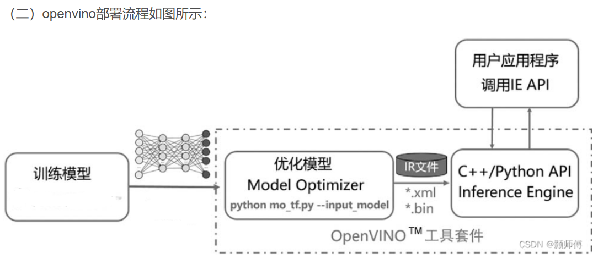

深度学习模型加速平台介绍

https://blog.csdn.net/LH13471605976/article/details/126035013

ONNX 入门

https://www.cnblogs.com/yanshw/p/16607884.html

ONNX 模型部署：TensorRT、OpenVino、ONNXRuntime 和 OpenCV dnn

https://www.cnblogs.com/xixixing/p/15830977.html

